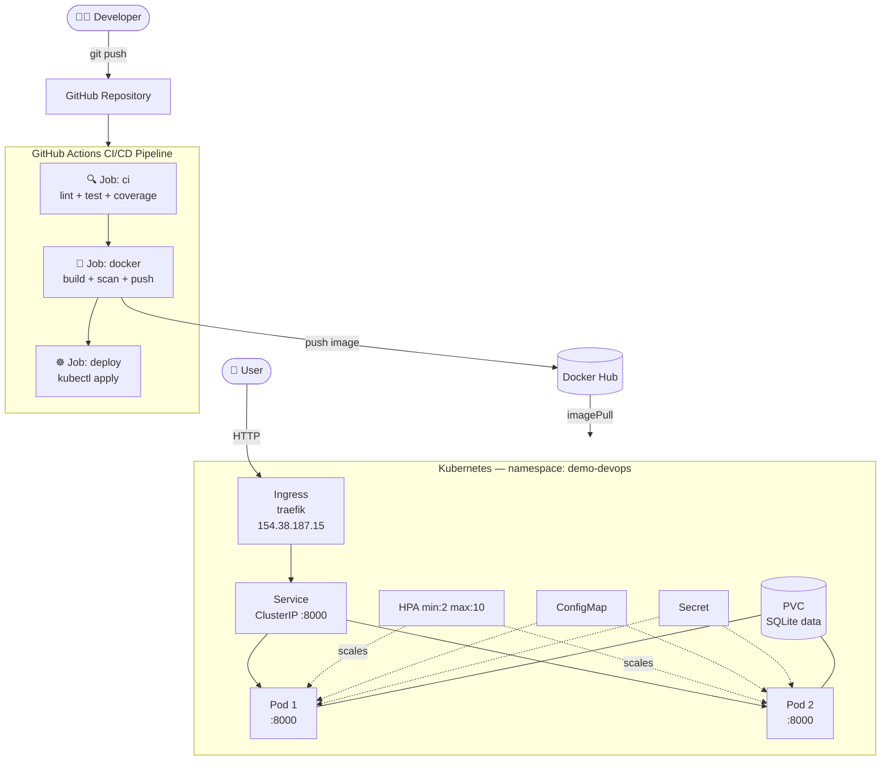

# demo-devops-nodejs — DevOps Technical Exercise

> Node.js + Express + SQLite application containerized with Docker, deployed on Kubernetes with a complete CI/CD pipeline using GitHub Actions.

---

## 📋 Table of Contents

- [Architecture Overview](#architecture-overview)
- [Project Structure](#project-structure)
- [Local Development](#local-development)
- [Docker](#docker)
- [CI/CD Pipeline](#cicd-pipeline)
- [Kubernetes Deployment](#kubernetes-deployment)
- [Secrets & Configuration](#secrets--configuration)
- [API Reference](#api-reference)

---

## Architecture Overview



---

## Project Structure

```
demo-devops-nodejs/
├── index.js                        # App entry point + /health endpoint
├── package.json                    # Added: lint script + eslint devDep
├── .eslintrc.json                  # ESLint config (ES Modules)
├── .dockerignore
├── Dockerfile                      # Multi-stage, non-root user, healthcheck
├── shared/
│   ├── database/database.js        # Sequelize + SQLite connection
│   ├── middleware/validateSchema.js
│   └── schema/users.js
├── users/
│   ├── controller.js
│   ├── model.js
│   └── router.js
├── index.test.js                   # Jest + supertest tests
├── .github/
│   └── workflows/
│       └── ci-cd.yml               # Full CI/CD pipeline (3 jobs)
└── k8s/
    ├── namespace.yaml
    ├── configmap.yaml
    ├── secret.yaml
    ├── pvc.yaml                    # PersistentVolumeClaim for SQLite
    ├── deployment.yaml             # 2 replicas, probes, resource limits
    ├── service.yaml                # ClusterIP :80 → :8000
    ├── ingress.yaml                # nginx ingress
    └── hpa.yaml                   # HPA min:2 max:10
```

---

## Local Development

```bash
# Install dependencies
npm install

# Run the application (port 8000)
npm start

# Run unit tests
npm test

# Run unit tests with coverage
npm test -- --coverage

# Run ESLint static analysis
npm run lint

# Test endpoints
curl http://localhost:8000/health
curl http://localhost:8000/api/users
```

---

## Docker

### Build

```bash
docker build -t demo-devops-nodejs:local .
```

### Run

```bash
docker run -d \
  --name demo-devops \
  -p 8000:8000 \
  -e NODE_ENV=production \
  -e PORT=8000 \
  -e DATABASE_NAME=/app/data/dev.sqlite \
  -e DATABASE_USER=user \
  -e DATABASE_PASSWORD=password \
  -v $(pwd)/data:/app/data \
  demo-devops-nodejs:local
```

### Test health check

```bash
curl http://localhost:8000/health
# {"status":"ok","uptime":5.123}
```

### Dockerfile key decisions

| Feature            | Decision                                              |
|--------------------|-------------------------------------------------------|
| Multi-stage build  | `deps` stage → `runtime` (smaller final image)        |
| Base image         | `node:18-alpine` (matches README requirement, ~50MB)  |
| Non-root user      | `nodeuser` uid 1001 / gid 1001                        |
| Health check       | `HEALTHCHECK` via `GET /health`                       |
| SQLite directory   | `/app/data/` — writable by nodeuser, mountable        |
| Env variables      | All configurable via `ENV` defaults                   |

---

## CI/CD Pipeline

Defined in `.github/workflows/ci-cd.yml`.

### Pipeline diagram

```mermaid
flowchart LR
    A([Push / PR]) --> B

    subgraph CI["🔍 Job: ci"]
        B[Checkout] --> C[Node 18 setup]
        C --> D[npm ci]
        D --> E[ESLint\nStatic Analysis]
        E --> F[Jest\nTests + Coverage]
        F --> G[Upload coverage\nartifact]
    end

    G --> H

    subgraph DOCKER["🐳 Job: docker"]
        H[Checkout] --> I[Docker Buildx]
        I --> J[Build image]
        J --> K[Trivy scan\nCRITICAL+HIGH]
        K --> L{main branch?}
        L -->|Yes| M[Login Docker Hub]
        M --> N[Push image:sha\n+ image:latest]
        L -->|No| O[Skip push]
    end

    N --> P

    subgraph DEPLOY["☸️ Job: deploy — main only"]
        P[Checkout] --> Q[Setup kubectl]
        Q --> R[Inject image tag\nsed IMAGE_PLACEHOLDER]
        R --> S[kubectl apply\nall manifests]
        S --> T[Rollout status\ntimeout 120s]
        T --> U[Verify pods]
    end
```



### Required GitHub Secrets

**Settings → Secrets and variables → Actions:**

| Secret               | How to get it                                          |
|----------------------|--------------------------------------------------------|
| `DOCKERHUB_USERNAME` | Your Docker Hub username                               |
| `DOCKERHUB_TOKEN`    | Docker Hub → Account Settings → Security → Access Token|
| `KUBECONFIG`         | `cat ~/.kube/config \| base64 -w0`                     |

---

## Kubernetes Deployment

### Local deployment with minikube

```bash
# 1. Start minikube
minikube start --driver=docker

# 2. Enable ingress addon
minikube addons enable ingress

# 3. Apply all manifests in order
kubectl apply -f k8s/namespace.yaml
kubectl apply -f k8s/configmap.yaml
kubectl apply -f k8s/secret.yaml
kubectl apply -f k8s/pvc.yaml
kubectl apply -f k8s/deployment.yaml
kubectl apply -f k8s/service.yaml
kubectl apply -f k8s/ingress.yaml
kubectl apply -f k8s/hpa.yaml

# 4. Verify pods (should show 2 Running)
kubectl get pods -n demo-devops

# 5. Test
curl http://154.38.187.15/health
curl http://154.38.187.15/api/users
```

### Kubernetes resources summary

| Resource    | Details                                                           |
|-------------|-------------------------------------------------------------------|
| Namespace   | `demo-devops`                                                     |
| ConfigMap   | NODE_ENV, PORT=8000, DATABASE_NAME, DATABASE_USER                 |
| Secret      | DATABASE_PASSWORD (base64)                                        |
| PVC         | 1Gi ReadWriteOnce for SQLite persistence                          |
| Deployment  | 2 replicas, liveness + readiness probes on `/health`, RollingUpdate|
| Service     | ClusterIP port 80 → container 8000                                |
| Ingress     | traefik, no host restriction (matches any IP/domain)              |
| HPA         | min 2 / max 10 pods, scales at CPU >70% or Memory >80%           |

### Note on SQLite + horizontal scaling

SQLite uses `ReadWriteOnce` access mode, meaning only one node can mount the PVC as read-write. Both replicas share the file which is acceptable for this exercise. **For a production environment**, the database should be migrated to PostgreSQL or MySQL with a proper Kubernetes StatefulSet or a managed cloud database, enabling true horizontal scaling.

---

## Secrets & Configuration

To update the database password:

```bash
echo -n "your-new-password" | base64
# Update the value in k8s/secret.yaml, then:
kubectl apply -f k8s/secret.yaml
kubectl rollout restart deployment/demo-devops-nodejs -n demo-devops
```

> ⚠️ Never commit real credentials. For production use **Sealed Secrets** or **HashiCorp Vault**.

---

## API Reference

Base URL: `http://154.38.187.15` (K8s) or `http://localhost:8000` (local)

| Method | Endpoint          | Description        |
|--------|-------------------|--------------------|
| GET    | `/health`         | Health check       |
| GET    | `/api/users`      | List all users     |
| GET    | `/api/users/:id`  | Get user by ID     |
| POST   | `/api/users`      | Create a new user  |

**POST /api/users body:**
```json
{ "dni": "1234567890", "name": "John Doe" }
```
